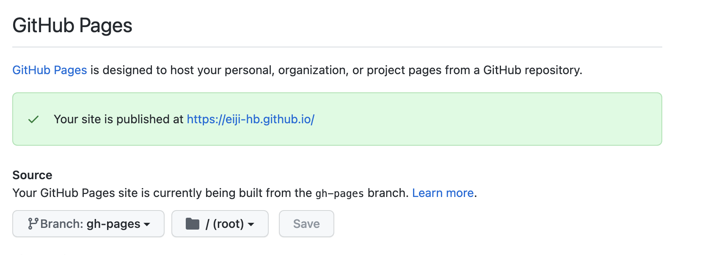

今回はこのブログをデプロイまで実施した手順をメモする。
## cliインストール
```
npm install -g gatsby-cli
```

## ブログテンプレート 生成
```
gatsby new my-blog-starter https://github.com/gatsbyjs/gatsby-starter-blog
```

## github pagesへ公開
1. githubリポジトリ作成
2. リポジトリ名は`<ユーザ名>.github.io`
```
ユーザもしくはOrganizationのサイトを作成しているなら、リポジトリは<user>.github.ioもしくは<organization>.github.ioという名前でなければなりません。
```
3. 作成したブログをpush
- `<ユーザ名>.github.io`の命名規則でリポジトリを作成した時点で自動的にGitHub Pagesとして公開されています。
- 試しに`<ユーザ名>.github.io`へアクセスするとREADME.mdが表示されていると思います。
```
index.htmlがあるなら、index.mdの代わりに利用されます。 index.htmlもindex.mdもないなら、README.mdが使われます。
```
- [GitHub Pages サイトを作成する](https://docs.github.com/ja/pages/getting-started-with-github-pages/creating-a-github-pages-site)

## ブログ部分をデプロイ
- gh-pagesのインストールをリポジトリ内にインストールする
```
npm install gh-pages --save-dev
```
- デプロイコマンドの追加
```package.json
{
  "scripts": {
    "deploy": "gatsby build --prefix-paths && gh-pages -d public"
  }
}
```
### デプロイコマンド
リポジトリ内のpublic/がデプロイされる
```
npm run deploy
```
### 公開するブランチの切り替え
以下の画像のようにブランチを`gh-pages`へ変更

- [How Gatsby Works with GitHub Pages](https://www.gatsbyjs.com/docs/how-to/previews-deploys-hosting/how-gatsby-works-with-github-pages/)

反映まで時間がかかります(2~3分)しばらく待てば公開されます！
- 現時点で色々テンプレのままが散見されるがおいおい直す予定